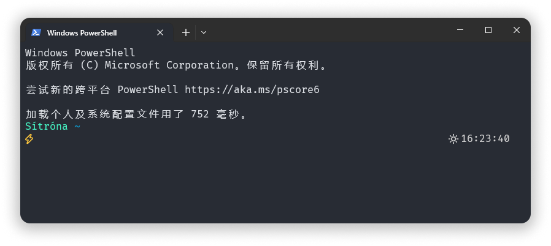

<h1 align="center">🍋 Sítróna</h2>
<p align="center"><sup>(/ˈsiːtʰrouːna/, <em>lemon</em> in Icelandic)</sup></p>

<p align="center">
  A Sitrona Theme for <a href="https://github.com/jandedobbeleer/oh-my-posh">oh-my-posh</a>.
<p>

<p align="center">
  
</p>

## Features

-   Beautiful.
-   Only necessay function.
-   Current time.
-   Git status.

## Usage

1. You need to install on-my-posh. I hope you have already installed.
2. Download the theme file and put it in the themes folder.
3. Open your PowerShell profile file and add the following line:

```powershell
notepad $PROFILE
```

add the following line(this will permanently change the theme):

```ps1
oh-my-posh init pwsh --config 'C:\Users\{YOUR_NAME}\AppData\Local\Programs\oh-my-posh\themes\sitrona.omp.json' | Invoke-Expression
```

4. Reload your PowerShell profile file.

```powershell
. $PROFILE
```

5. Enjoy!

## Author

👤 **[wjjwkwindy](https://github.com/wjjwkwindy)**
